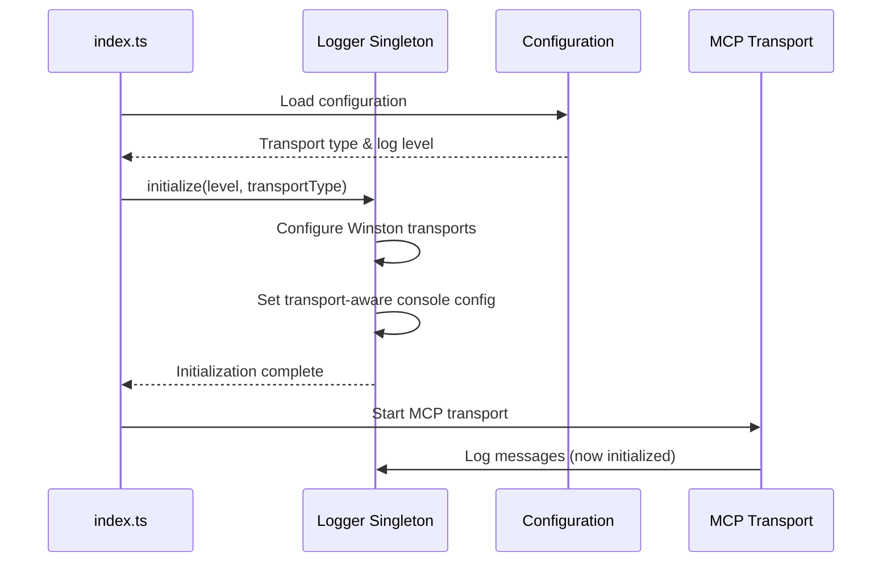

# Design Document

## Overview

The MCP server logger initialization issue stems from a race condition where components attempt to log messages before the logger singleton is properly initialized. The current implementation has an asynchronous initialization process that doesn't guarantee completion before other components start logging. This design addresses the initialization sequence, transport-aware configuration, and proper error handling.

## Architecture

### Current Problem Analysis

1. **Race Condition**: Logger.getInstance() returns an uninitialized instance that drops messages
2. **Async Initialization**: Logger.initialize() is async but not awaited properly in all code paths
3. **Transport Awareness**: Logger doesn't properly detect and adapt to MCP transport type during initialization
4. **Error Handling**: Failed initialization doesn't prevent continued execution

### Proposed Solution Architecture



## Components and Interfaces

### 1. Enhanced Logger Initialization

**Interface Changes:**
```typescript
interface LoggerInitializationOptions {
  level: McpLogLevel;
  transportType: 'stdio' | 'http';
  environment: string;
  logsPath?: string;
}

class Logger {
  public async initialize(options: LoggerInitializationOptions): Promise<void>
  private configureTransportAwareLogging(transportType: string): void
  private ensureInitialized(): boolean
}
```

**Key Improvements:**
- Transport-aware initialization with explicit transport type parameter
- Synchronous initialization check with proper error handling
- Environment-based configuration adaptation

### 2. Startup Sequence Orchestration

**Modified index.ts Flow:**
```typescript
async function start(): Promise<void> {
  // 1. Load configuration first
  const config = await loadConfiguration();
  
  // 2. Initialize logger with transport awareness
  await logger.initialize({
    level: config.logLevel,
    transportType: config.mcpTransportType,
    environment: config.environment,
    logsPath: config.logsPath
  });
  
  // 3. Now safe to log startup messages
  logger.info("Logger initialized successfully");
  
  // 4. Continue with MCP server initialization
  const server = await initializeAndStartServer();
}
```

### 3. Transport-Aware Console Configuration

**Console Transport Logic:**
```typescript
private configureTransportAwareLogging(transportType: string): void {
  const isStdioTransport = transportType === 'stdio';
  const shouldEnableConsole = !isStdioTransport && 
                             process.stdout.isTTY && 
                             this.currentMcpLevel === 'debug';
  
  if (shouldEnableConsole && !this.hasConsoleTransport()) {
    this.addConsoleTransport();
  } else if (!shouldEnableConsole && this.hasConsoleTransport()) {
    this.removeConsoleTransport();
  }
}
```

### 4. Error Handling and Fallbacks

**Graceful Degradation:**
- File logging failure → Continue with console/stderr only
- Invalid log level → Default to 'info' with warning
- Transport detection failure → Default to safe configuration
- Multiple initialization attempts → Ignore safely

## Data Models

### Logger State Management

```typescript
interface LoggerState {
  initialized: boolean;
  initializationPromise?: Promise<void>;
  currentLevel: McpLogLevel;
  transportType: 'stdio' | 'http';
  consoleEnabled: boolean;
  fileLoggingEnabled: boolean;
}
```

### Configuration Integration

```typescript
interface McpServerConfig {
  logLevel: McpLogLevel;
  mcpTransportType: 'stdio' | 'http';
  environment: string;
  logsPath?: string;
}
```

## Error Handling

### 1. Initialization Errors

**Strategy**: Fail fast with clear error messages
- Log directory creation failure → Warn and continue without file logging
- Invalid configuration → Use safe defaults and warn
- Winston setup failure → Fall back to console.error and exit

### 2. Runtime Errors

**Strategy**: Graceful degradation
- Message logging before initialization → Queue or drop with warning
- Transport configuration changes → Reconfigure safely
- File system errors → Continue with available transports

### 3. Transport-Specific Error Handling

**STDIO Transport:**
- Redirect all console output to stderr
- Ensure stdout remains clean for JSON-RPC
- Handle process.stdout.write errors gracefully

**HTTP Transport:**
- Allow console logging for debugging
- Handle HTTP server startup errors
- Maintain log correlation across requests

## Testing Strategy

### 1. Unit Tests

**Logger Initialization:**
- Test successful initialization with various configurations
- Test initialization failure scenarios
- Test multiple initialization attempts
- Test transport-aware configuration

**Transport Detection:**
- Test STDIO transport console disabling
- Test HTTP transport console enabling
- Test TTY detection logic
- Test environment-based configuration

### 2. Integration Tests

**Startup Sequence:**
- Test complete server startup with STDIO transport
- Test complete server startup with HTTP transport
- Test startup with invalid configuration
- Test startup with missing log directory

**Error Scenarios:**
- Test behavior when logs directory is not writable
- Test behavior with invalid log levels
- Test behavior with missing environment variables

### 3. End-to-End Tests

**MCP Communication:**
- Test STDIO transport without console interference
- Test HTTP transport with proper logging
- Test log message correlation across requests
- Test graceful shutdown with proper log cleanup

## Implementation Notes

### 1. Backward Compatibility

- Maintain existing Logger.getInstance() interface
- Preserve existing log level methods (debug, info, warn, error)
- Keep existing configuration environment variables

### 2. Performance Considerations

- Minimize initialization overhead
- Use lazy loading for Winston transports
- Avoid blocking operations during startup
- Implement efficient transport switching

### 3. Security Considerations

- Ensure log directory permissions are secure
- Prevent log injection attacks
- Sanitize log messages appropriately
- Handle sensitive data in logs properly