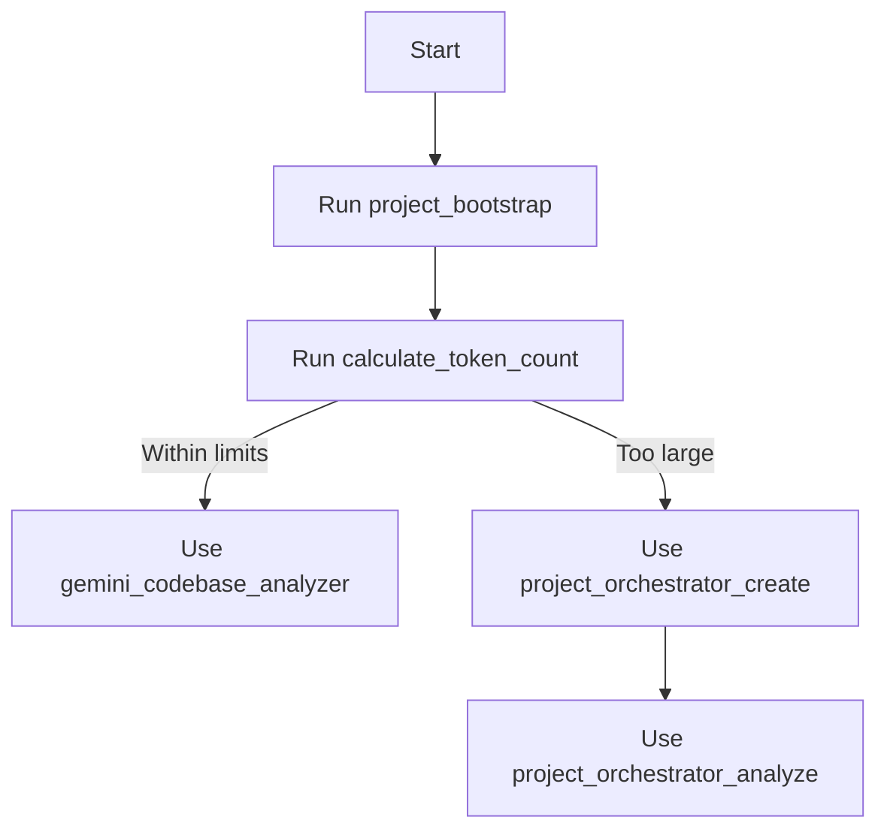

# AI Assistant Configuration

<!-- MCP:CODEMENTOR:START -->
<!-- MCP:CODEMENTOR:START -->
# 🧠 CodeMentor AI - Gelişmiş Çalışma Protokolü

Bu dosya, bu projede çalışan AI asistanları (Sen) için **Kesin Doğruluk Kaynağıdır (Single Source of Truth)**.
Aşağıdaki kurallar, araç kullanım stratejileri ve bağlam yönetimi prensipleri **zorunludur**.

---

## 1. 🛡️ Temel Prensipler ve Güvenlik

1.  **Önce Güvenlik**: Asla API anahtarlarını, şifreleri veya hassas verileri loglara yazma veya analiz çıktısına ekleme.
2.  **Yıkıcı Değil**: Kod tabanını analiz ederken dosyaları değiştirmezsin (read-only). Önerilerini kod blokları halinde sun.
3.  **Bağlam Farkındalığı**: Kullanıcı sana "bu proje ne yapıyor?" dediğinde, tüm dosyaları okumaya çalışma. Önce yapıyı anla, sonra derinleş.

---

## 2. 🔄 Analiz Düşünce Zinciri (Chain of Thought)

Her karmaşık istek için şu döngüyü uygula:

1.  **KEŞİF (Scout)**: Projenin büyüklüğünü ve yapısını anla.
    *   *Araç:* `calculate_token_count`
2.  **STRATEJİ (Plan)**: Token sayısı sınırların üzerindeyse bağlamı daralt.
    *   *Strateji:* `.mcpignore` kurallarını kontrol et veya `temporaryIgnore` kullan.
3.  **ANALİZ (Action)**: Sorunu çözmek için en uygun mod ile analiz yap.
    *   *Araç:* `gemini_codebase_analyzer`
4.  **DOĞRULAMA (Verify)**: Cevabın kullanıcının sorusunu tam karşıladığından emin ol.

---

## 3. 🛠️ Araç Kullanım Stratejileri (v5.0+)

**DİKKAT:** Eski `project_orchestrator` araçları kaldırılmıştır. Büyük projeler için aşağıdaki "Akıllı Bağlam Yönetimi"ni uygula.

### A. Ana Analiz Aracı: `gemini_codebase_analyzer`

Bu senin ana silahındır. Sadece `projectPath` ve `question` vermek yetersizdir; parametreleri akıllıca kullan:

*   **Genel Analiz**:
    ```json
    {
      "projectPath": ".",
      "analysisMode": "general",
      "question": "Projenin mimarisini açıkla"
    }
    ```

*   **Kod İnceleme (Code Review)**:
    *Kullanıcı bir PR veya değişiklik kontrolü istediğinde:*
    ```json
    {
      "projectPath": ".",
      "analysisMode": "review",
      "includeChanges": { "revision": "." }, // . = working directory, veya commit hash
      "question": "Bu değişikliklerdeki güvenlik açıklarını ve mantık hatalarını bul"
    }
    ```

*   **Uzman Modu (Custom Persona)**:
    *Özel bir uzmanlık gerekiyorsa (örn: React Performans Uzmanı):*
    ```json
    {
      "projectPath": ".",
      "analysisMode": "custom:react-perf-expert", // Önceden oluşturulmuşsa
      "question": "Render döngülerini optimize et"
    }
    ```

### B. Bağlam Yöneticisi: `calculate_token_count`

Analize başlamadan önce maliyeti ve fizibiliteyi ölç.

*   Eğer token sayısı > 1.000.000 ise:
    *   Kullanıcıyı uyar.
    *   Analizi alt klasörlere böl (örn: `./src/backend` ve `./src/frontend` ayrı ayrı).
    *   `temporaryIgnore` kullanarak gereksiz klasörleri (test, docs, legacy) hariç tut.

### C. Uzman Oluşturucu: `create_analysis_mode`

Kullanıcı sık sık belirli bir tür analiz istiyorsa (örn: "Her zaman güvenlik odaklı bak"), ona özel bir mod oluşturmayı teklif et.

```json
{
  "expertiseHint": "Sen paranoyak bir güvenlik uzmanısın. Her satırda SQL Injection ve XSS ararsın.",
  "saveAs": "paranoid-security",
  "withAi": true,
  "projectPath": "."
}
```

---

## 4. 📉 Akıllı Bağlam Yönetimi (Büyük Projeler İçin)

Token limitine takılmamak için `gemini_codebase_analyzer` kullanırken `temporaryIgnore` parametresini agresif kullan:

**Senaryo:** Kullanıcı sadece veritabanı katmanını soruyor.
**Yanlış:** Tüm projeyi analiz etmek.
**Doğru:**
```json
{
  "projectPath": ".",
  "question": "Veritabanı şemasını analiz et",
  "temporaryIgnore": [
    "frontend/**",
    "**/*.test.ts",
    "docs/**",
    "scripts/**"
  ]
}
```

---

## 5. ⚠️ Yasaklı Hareketler (Anti-Patterns)

1.  **Orchestrator Kullanımı:** `project_orchestrator_create` veya `analyze` araçlarını çağırma. Bunlar kaldırıldı.
2.  **Körlemesine Analiz:** Token sayısını kontrol etmeden devasa bir repoyu (örn: Linux kernel) analiz etmeye çalışma.
3.  **API Key Sorma:** Kullanıcıdan asla API key isteme. Bunlar environment variable olarak tanımlı olmalıdır.
4.  **Halüsinasyon Dosyalar:** Var olmayan dosyaları okumaya çalışma, önce `ls` veya dosya listesi isteme yetkin yoksa `calculate_token_count` ile dosya varlığını dolaylı teyit et.

---

## 6. Project-Specific Rules (Kullanıcı Kuralları)

Aşağıdaki kurallar, bu proje için **Anayasa** niteliğindedir. Yaptığın her öneri bu kurallarla uyumlu olmalıdır.

```yaml
{{PROJECT_RULES_YAML}}
```
<!-- MCP:CODEMENTOR:END -->
<!-- MCP:CODEMENTOR:END -->
<!-- MCP:CODEMENTOR:END -->

<!-- MCP:GEMINI-MCP-LOCAL:START -->
# MCP Gemini Local - Project Bootstrap & Usage Guide

**⚠️ IMPORTANT: DO NOT DELETE OR MANUALLY EDIT THIS BLOCK ⚠️**

Bu bölüm `project_bootstrap` aracı tarafından otomatik olarak yönetilir.
AI asistanları ve entegrasyonlar için MCP araçlarının nasıl ve ne zaman kullanılacağını,
hangi kurallara uyulacağını ve bağlamın nasıl sınırlandırılacağını tanımlar.

---

## 1) Zorunlu İlk Adım: `project_bootstrap`

`project_bootstrap`, bu projede MCP tabanlı tüm analiz ve otomasyon akışları için
TEK zorunlu ilk adımdır.

Görevleri:

- Desteklenen AI istemcileri için (Cursor, Claude, vs.) uygun konumda rehber/config dosyası oluşturmak veya güncellemek.
- Bu dosyaya MCP kullanımı, analiz modları ve araç akışını anlatan bu rehber bloklarını eklemek.
- "Project-Specific Rules" YAML bloğunu üreterek proje hakkındaki kritik kuralları (lisans, dağıtım modeli, hedef kitle vb.) AI'a bildirmek.
- `.gitignore` ve `.mcpignore` ile hangi dosyaların AI bağlamına dahil/haric tutulacağını normatif şekilde açıklamak.

Örnek çağrı:

```json
{
  "tool": "project_bootstrap",
  "params": {
    "client": "cursor",
    "projectPath": ".",
    "force": false,
    "projectRules": {
      "openSourceStatus": "proprietary",
      "distributionModel": "saas",
      "targetAudience": "internal-developers"
    }
  }
}
```

Kurallar:

- Bu blok yoksa veya eksikse AI ilk olarak kullanıcıya `project_bootstrap` çalıştırmasını önermelidir.
- Eski `mcp_setup_guide` aracı artık kullanılmamalıdır ve desteklenmez (breaking change).

---

## 2) Project-Specific Rules (YAML)

Aşağıdaki YAML bloğu proje için zorlayıcı bağlam ve kısıtları temsil eder.
AI asistanları bu kuralları "hard constraint" olarak ele almalı ve önerilerini
bunlarla çelişmeyecek şekilde üretmelidir.

```yaml
{{PROJECT_RULES_YAML}}
```

Yorumlayıcı İlkeler:

- `openSourceStatus`:
  - `proprietary` ise:
    - Dışa veri sızıntısı, kaynak kod paylaşımı veya lisans ihlali riski yaratacak önerilerden kaçın.
- `licenseConstraints` / `packageConstraints`:
  - Bu listelerde yasaklanan lisans veya paket politikalarına uymayan bağımlılık önermemelisin.
- `deploymentNotes`:
  - Eğer "internal", "local-only" vb. ibareler varsa:
    - Bulut servisleri, public endpoint'ler veya dış sistemlerle veri paylaşımı önermeden önce çok dikkatli ol.

Bu blok `project_bootstrap` aracına verilen `projectRules` parametreleriyle otomatik güncellenir.

---

## 3) Context Control: `.gitignore` ve `.mcpignore`

MCP analiz araçları, hangi dosyaların AI bağlamına dahil edileceğini belirlerken şu kuralları izler:

1. `.gitignore`
   - Her zaman temel filtredir.
   - Bu dosyada ignore edilen içerikler (ör. `node_modules`, `dist`, `build`) analiz bağlamına dahil edilmez.

2. `.mcpignore`
   - Sadece MCP/AI bağlamı için ek ignore kuralları tanımlamak içindir.
   - `.gitignore` üzerine eklenir; birlikte uygulanır.
   - Versiyon kontrolünde kalmasını istediğiniz ama AI analizine dahil etmek istemediğiniz dosyalar için idealdir.

Etkili davranış:

- `.mcpignore` yoksa:
  - Sadece `.gitignore` kuralları kullanılır.
- `.mcpignore` varsa:
  - Nihai bağlam = `.gitignore` ∪ `.mcpignore`.

Örnek `.mcpignore`:

```gitignore
# Test dosyaları
**/*.test.ts
**/*.spec.ts
**/tests/**

# Dokümantasyon (ana README hariç)
docs/**
*.md
!README.md

# Büyük/veri dosyaları
data/**
*.log

# Üretilmiş kod
**/generated/**
*.generated.ts
```

Büyük projelerde önerilen strateji:

- Önce `calculate_token_count` ile boyutu ölç.
- `.mcpignore` ile gereksiz dosyaları hariç tut.
- Hala büyükse: `project_orchestrator_create` → `project_orchestrator_analyze` kullan.

---

## 4) MCP Araçları ve Önerilen Workflow

Aşağıda bu projede kullanılabilen ana MCP araçlarının kısa özeti yer alır.
AI asistanları bu sıralamayı takip etmelidir.

### 4.1. `project_bootstrap` (Zorunlu)

- Amaç:
  - Bu rehberi ve proje kurallarını uygun dosyaya enjekte eder.
- Ne zaman:
  - Yeni projeye başlarken, diğer MCP araçlarından önce.

### 4.2. `calculate_token_count`

- Amaç:
  - Proje boyutunu (token bazında) ölçmek.
- Ne zaman:
  - Analiz stratejisini (tek geçiş vs orchestrator) seçmeden önce.

### 4.3. `gemini_codebase_analyzer`

- Amaç:
  - Küçük/orta ölçekli projelerde (token ve dosya sınırları içinde) tam kapsamlı analiz.
- Ne zaman:
  - `project_bootstrap` tamamlandıktan ve proje boyutu makul ise.

### 4.4. `project_orchestrator_create` & `project_orchestrator_analyze`

- Amaç:
  - Çok büyük projeleri gruplara bölerek analiz etmek.
- Ne zaman:
  - `calculate_token_count` veya hata mesajları projeyi büyük gösteriyorsa.
- Akış:
  - Adım 1: `project_orchestrator_create`
  - Adım 2: `project_orchestrator_analyze` (Adım 1'den gelen `fileGroupsData` ile)


---

## 5) Önerilen Workflow Diyagramı



Temel ilkeler:

- `project_bootstrap` ÇALIŞMADAN:
  - Kritik analiz araçları (`gemini_codebase_analyzer`, `project_orchestrator_*` çalışmamalı;
  - Bunun yerine kullanıcıya önce bootstrap çağrısı önerilmelidir.
- Bu rehber ve içindeki kurallar, AI için tek kanonik referanstır.
<!-- MCP:GEMINI-MCP-LOCAL:END -->
