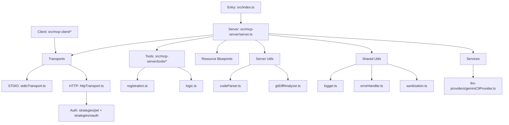
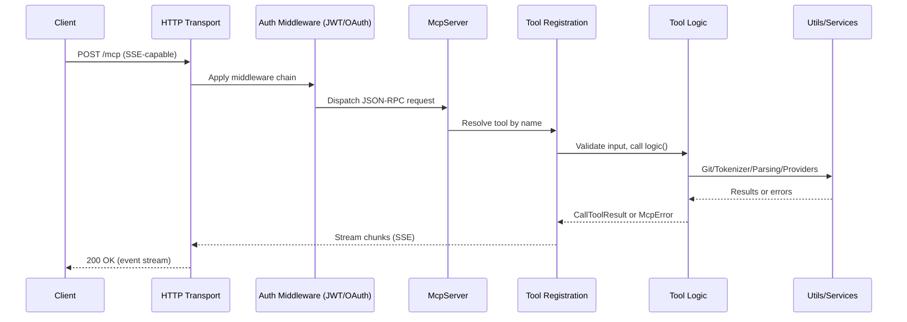
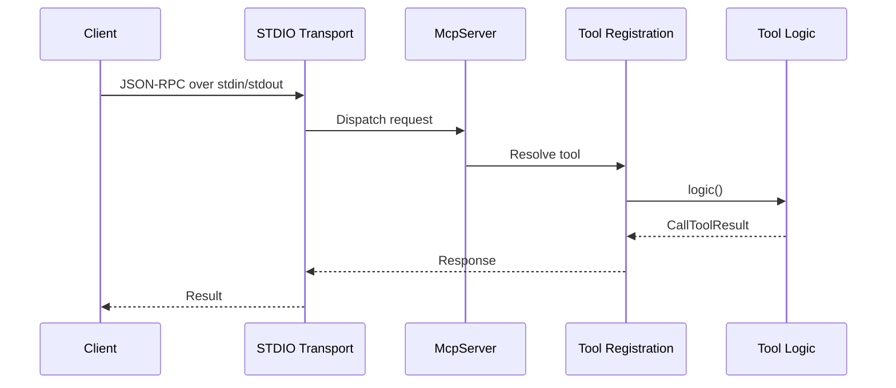
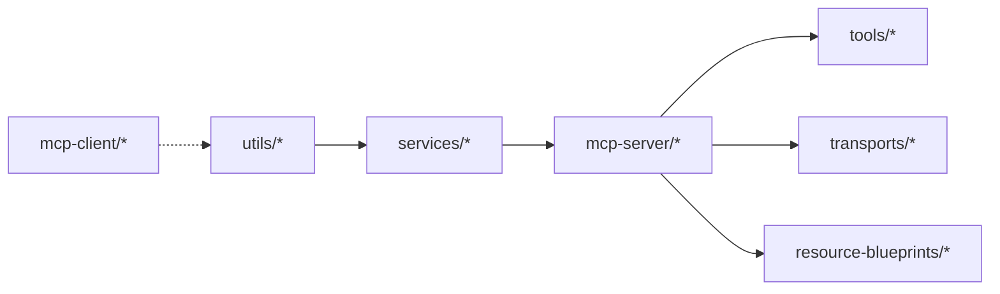

# Architecture Overview

This document explains the high-level architecture, request flows, module boundaries, and extension points of the Gemini MCP Local project.

Key source areas:
- src/index.ts — process bootstrap and server startup
- src/mcp-server/server.ts — MCP server creation and tool registration
- src/mcp-server/transports/ — stdio and HTTP transports
- src/mcp-server/transports/auth/ — JWT and OAuth strategies with auth context
- src/mcp-server/tools/ — tools (logic + registration)
- src/mcp-server/resource-blueprints/ — resource registration examples
- src/utils/ — logging, errors, metrics, parsing, security
- src/services/ — LLM providers
- src/mcp-client/ — reusable MCP client

---

## 1) High-level component map

Notes:
- Tools follow a blueprint: thin registration + throwy, testable logic.
- HTTP transport includes CORS, rate limit, and auth middlewares.
- STDIO transport is ideal for local IDE/desktop MCP clients.
- HTTP transport can use a SessionCoordinator (InMemory/Redis) to track `mcp-session-id` ownership for sticky sessions in multi-instance deployments.
- Optional Redis-backed coordinator persists only ownership metadata; see src/mcp-server/transports/sessionStore.ts for implementations.
---

## 2) HTTP request flow (streamable)

Key points:
- Session is derived from header (mcp-session-id) when present.
- Large diffs and binaries are skipped via size caps for safety.
- Errors are normalized to McpError for consistent clients.

---

## 3) STDIO request flow

Characteristics:
- No HTTP auth; runs within caller's process context.
- Console logs are suppressed to avoid breaking JSON-RPC.

---

## 4) Dependency layers

Rationale:
- One-way edges reduce circular dependencies and improve testability.
- Tools depend on server and shared utils; clients are optional consumers.

---

## 5) Configuration overview

- Single source of truth: src/config/index.ts (Zod-validated)
- Notable envs:
  - MCP_TRANSPORT_TYPE (stdio|http), MCP_HTTP_PORT, MCP_HTTP_HOST
  - MCP_AUTH_MODE (jwt|oauth), MCP_AUTH_SECRET_KEY
  - LLM_DEFAULT_PROVIDER, LLM_DEFAULT_MODEL
  - MAX_GIT_BLOB_SIZE_BYTES (skip oversized files in diff)
- Example file: .env.example

---

## 6) Extending with a new Tool

1. Create a folder under src/mcp-server/tools/myTool/
2. Implement logic.ts (pure, throws McpError on failure)
3. Implement registration.ts (schema, handler, error wrapping)
4. Register during server bootstrap (server.ts)
5. Add unit tests for both positive and negative paths

---

## 7) Security surfaces and controls

- Path traversal: securePathValidator + sanitization.sanitizePath
- Git safety: revision validation + simple-git wrapper
- Auth (HTTP): JWT with secret key (dev) or OAuth with JWKS (prod)
- Rate limiting: utils/security/rateLimiter.ts
- Input validation: Zod schemas at registration boundaries
- Logging hygiene: sanitize sensitive values before writing

---

## 8) Performance considerations

- Full-project context building can be heavy; prefer project orchestrator on large repos
- Tree-sitter grammars are warmed up at startup for better p95
- Gemini CLI calls are serialized with AsyncLock to protect JSON-RPC streams
- Large git blobs are skipped early by size guardrails

---

## 9) Where to look next

- Project layout section in README for commands and structure
- docs/best-practices.md for coding patterns and conventions
- tests/unit for reference test scaffolding