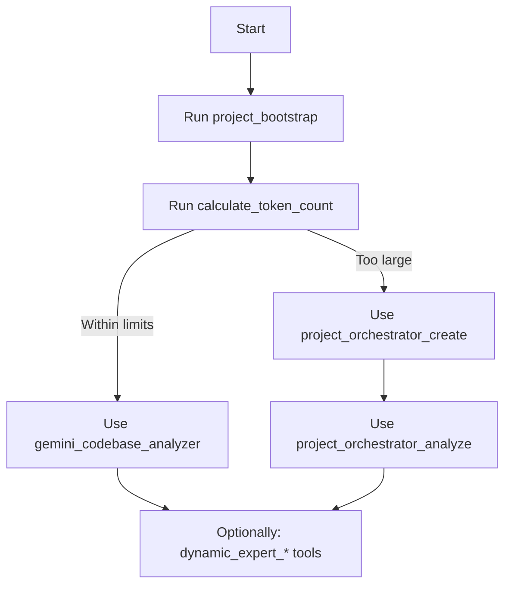

# MCP Gemini Local - Project Bootstrap & Usage Guide

**⚠️ IMPORTANT: DO NOT DELETE OR MANUALLY EDIT THIS BLOCK ⚠️**

Bu bölüm `project_bootstrap` aracı tarafından otomatik olarak yönetilir.
AI asistanları ve entegrasyonlar için MCP araçlarının nasıl ve ne zaman kullanılacağını,
hangi kurallara uyulacağını ve bağlamın nasıl sınırlandırılacağını tanımlar.

---

## 1) Zorunlu İlk Adım: `project_bootstrap`

`project_bootstrap`, bu projede MCP tabanlı tüm analiz ve otomasyon akışları için
TEK zorunlu ilk adımdır.

Görevleri:

- Desteklenen AI istemcileri için (Cursor, Claude, vs.) uygun konumda rehber/config dosyası oluşturmak veya güncellemek.
- Bu dosyaya MCP kullanımı, analiz modları ve araç akışını anlatan bu rehber bloklarını eklemek.
- "Project-Specific Rules" YAML bloğunu üreterek proje hakkındaki kritik kuralları (lisans, dağıtım modeli, hedef kitle vb.) AI'a bildirmek.
- `.gitignore` ve `.mcpignore` ile hangi dosyaların AI bağlamına dahil/haric tutulacağını normatif şekilde açıklamak.

Örnek çağrı:

```json
{
  "tool": "project_bootstrap",
  "params": {
    "client": "cursor",
    "projectPath": ".",
    "force": false,
    "projectRules": {
      "openSourceStatus": "proprietary",
      "distributionModel": "saas",
      "targetAudience": "internal-developers"
    }
  }
}
```

Kurallar:

- Bu blok yoksa veya eksikse AI ilk olarak kullanıcıya `project_bootstrap` çalıştırmasını önermelidir.
- Eski `mcp_setup_guide` aracı artık kullanılmamalıdır ve desteklenmez (breaking change).

---

## 2) Project-Specific Rules (YAML)

Aşağıdaki YAML bloğu proje için zorlayıcı bağlam ve kısıtları temsil eder.
AI asistanları bu kuralları "hard constraint" olarak ele almalı ve önerilerini
bunlarla çelişmeyecek şekilde üretmelidir.

```yaml
{{PROJECT_RULES_YAML}}
```

Yorumlayıcı İlkeler:

- `openSourceStatus`:
  - `proprietary` ise:
    - Dışa veri sızıntısı, kaynak kod paylaşımı veya lisans ihlali riski yaratacak önerilerden kaçın.
- `licenseConstraints` / `packageConstraints`:
  - Bu listelerde yasaklanan lisans veya paket politikalarına uymayan bağımlılık önermemelisin.
- `deploymentNotes`:
  - Eğer "internal", "local-only" vb. ibareler varsa:
    - Bulut servisleri, public endpoint'ler veya dış sistemlerle veri paylaşımı önermeden önce çok dikkatli ol.

Bu blok `project_bootstrap` aracına verilen `projectRules` parametreleriyle otomatik güncellenir.

---

## 3) Context Control: `.gitignore` ve `.mcpignore`

MCP analiz araçları, hangi dosyaların AI bağlamına dahil edileceğini belirlerken şu kuralları izler:

1. `.gitignore`
   - Her zaman temel filtredir.
   - Bu dosyada ignore edilen içerikler (ör. `node_modules`, `dist`, `build`) analiz bağlamına dahil edilmez.

2. `.mcpignore`
   - Sadece MCP/AI bağlamı için ek ignore kuralları tanımlamak içindir.
   - `.gitignore` üzerine eklenir; birlikte uygulanır.
   - Versiyon kontrolünde kalmasını istediğiniz ama AI analizine dahil etmek istemediğiniz dosyalar için idealdir.

Etkili davranış:

- `.mcpignore` yoksa:
  - Sadece `.gitignore` kuralları kullanılır.
- `.mcpignore` varsa:
  - Nihai bağlam = `.gitignore` ∪ `.mcpignore`.

Örnek `.mcpignore`:

```gitignore
# Test dosyaları
**/*.test.ts
**/*.spec.ts
**/tests/**

# Dokümantasyon (ana README hariç)
docs/**
*.md
!README.md

# Büyük/veri dosyaları
data/**
*.log

# Üretilmiş kod
**/generated/**
*.generated.ts
```

Büyük projelerde önerilen strateji:

- Önce `calculate_token_count` ile boyutu ölç.
- `.mcpignore` ile gereksiz dosyaları hariç tut.
- Hala büyükse: `project_orchestrator_create` → `project_orchestrator_analyze` kullan.

---

## 4) MCP Araçları ve Önerilen Workflow

Aşağıda bu projede kullanılabilen ana MCP araçlarının kısa özeti yer alır.
AI asistanları bu sıralamayı takip etmelidir.

### 4.1. `project_bootstrap` (Zorunlu)

- Amaç:
  - Bu rehberi ve proje kurallarını uygun dosyaya enjekte eder.
- Ne zaman:
  - Yeni projeye başlarken, diğer MCP araçlarından önce.

### 4.2. `calculate_token_count`

- Amaç:
  - Proje boyutunu (token bazında) ölçmek.
- Ne zaman:
  - Analiz stratejisini (tek geçiş vs orchestrator) seçmeden önce.

### 4.3. `gemini_codebase_analyzer`

- Amaç:
  - Küçük/orta ölçekli projelerde (token ve dosya sınırları içinde) tam kapsamlı analiz.
- Ne zaman:
  - `project_bootstrap` tamamlandıktan ve proje boyutu makul ise.

### 4.4. `project_orchestrator_create` & `project_orchestrator_analyze`

- Amaç:
  - Çok büyük projeleri gruplara bölerek analiz etmek.
- Ne zaman:
  - `calculate_token_count` veya hata mesajları projeyi büyük gösteriyorsa.
- Akış:
  - Adım 1: `project_orchestrator_create`
  - Adım 2: `project_orchestrator_analyze` (Adım 1'den gelen `fileGroupsData` ile)

### 4.5. `gemini_dynamic_expert_create` & `gemini_dynamic_expert_analyze`

- Amaç:
  - Proje bağlamında özel uzman persona oluşturmak ve bu uzmanla detaylı analiz yapmak.
- Ne zaman:
  - Belirli teknoloji/alan odaklı derin analiz gerektiğinde.

---

## 5) Önerilen Workflow Diyagramı



Temel ilkeler:

- `project_bootstrap` ÇALIŞMADAN:
  - Kritik analiz araçları (`gemini_codebase_analyzer`, `project_orchestrator_*`, `dynamic_expert_*`) çalışmamalı;
  - Bunun yerine kullanıcıya önce bootstrap çağrısı önerilmelidir.
- Bu rehber ve içindeki kurallar, AI için tek kanonik referanstır.